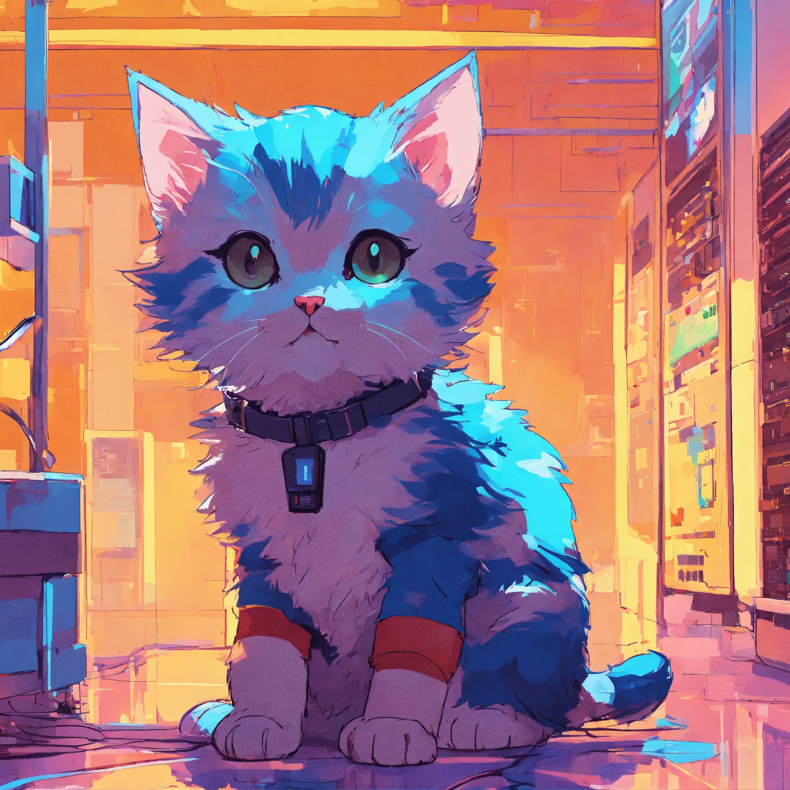

# Sprite Fusion Pixel Snapper - Python Binding


A Python binding for
[Pixel Snapper](https://github.com/Hugo-Dz/spritefusion-pixel-snapper) by
[Hugo Duprez](https://www.hugoduprez.com/). Snap pixels to a perfect grid -
designed to fix messy and inconsistent pixel art generated by AI.

## Example

| Input | Output |
| ----- | ------ |
|  |  |

## Installation

```bash
pip install pixel-snapper
```

Or build from source with [maturin](https://github.com/PyO3/maturin):

```bash
pip install maturin
maturin develop --features python
```

## Usage

### Library

```python
from pixel_snapper import PixelSnapperConfig, process_image, process_file_cli

# Process image bytes
config = PixelSnapperConfig(k_colors=16, pixel_size_override=8)
output_bytes = process_image(input_bytes, config)

# Process file directly
process_file_cli("input.png", "output.png", config)
```

### CLI

```bash
pixel-snapper input.png output.png
pixel-snapper input.png output.png 16
pixel-snapper input.png output.png --pixel-size 8
pixel-snapper sprites/batch_inputs sprites/batch_outputs 16
```

### Batch processing with progress

```python
from pixel_snapper import PixelSnapperConfig, process_batch

def on_event(event):
    print(f"[{event['type']}] {event}")

config = PixelSnapperConfig(k_colors=16)
process_batch("input_dir", "output_dir", config, on_event)
```

## Acknowledgments

This is a Python binding fork of
[spritefusion-pixel-snapper](https://github.com/Hugo-Dz/spritefusion-pixel-snapper)
by [Hugo Duprez](https://www.hugoduprez.com/). All credit for the original Rust
implementation goes to the original authors.

## License

MIT License - See [LICENSE](LICENSE) for details.
